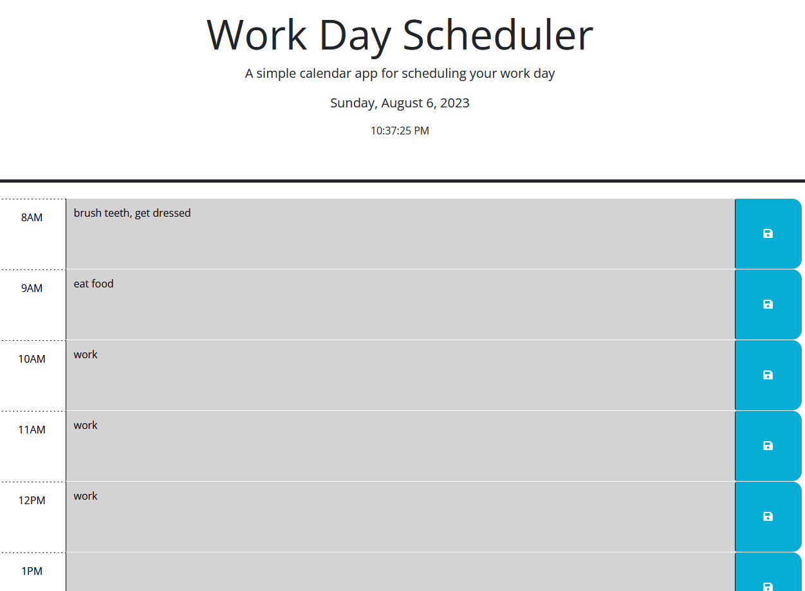

# Work Day Scheduler
  
  ## Description
  Simple work day planner for keeping track of hourly activities.
  ## Deployed Application URL
  https://github.com/tridean/05-challenge-tpa-tridean
  ## Screenshot
  
  ## Table of Contents
  * [Technologies Used](#Technologies-Used)
  * [Contributors](#contributors)
  * [Testing](#testing)
  * [Questions](#questions)
  ## Technologies Used
  HTML, CSS, JS, jQuery, Day.js
  ## Contributors
  Various sources for efficient fetching of data from text input as well as parsing ids as integers.
  ## Testing
  Type into the provided boxes and click the save button on the right to save your activity to local storage.
  ## Questions
  Send all questions to tridean97@gmail.com or check out my [GitHub](https://github.com/tridean).
  ## License
This project is covered under MIT.
